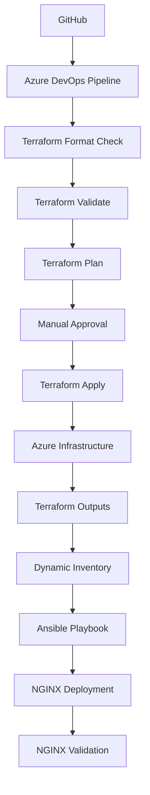

# Azure Platform Engineering Lab
## Overview

This project demonstrates the design, deployment, and automation of a Microsoft Azure platform using Infrastructure as Code (Terraform), Configuration Management (Ansible), and CI/CD (Azure DevOps).

The solution provisions Azure infrastructure using Terraform, stores state remotely in Azure Blob Storage, deploys and configures a Linux VM, and automates validation, planning, approval, deployment, and configuration management through Azure DevOps pipelines.

The end result is a fully automated Infrastructure and Configuration as Code workflow.

## Solution Architecture

## Key Learning Outcomes

This project demonstrates practical experience with:

-Infrastructure as Code
-Azure Networking
-Linux Administration
-Terraform State Management
-Terraform CI/CD Pipelines
-Azure DevOps Service Connections
-Deployment Approval Gates
-Dynamic Inventory Management
-Ansible Automation
-End-to-End Platform Engineering Workflows
-Future Enhancements

Potential future improvements include:

-DNS integration
-HTTPS with Let's Encrypt
-Azure Key Vault integration
-Monitoring with Azure Monitor
-Log Analytics integration
-Multi-environment deployments (Dev/Test/Prod)
-Self-hosted Azure DevOps agents
-Blue/Green deployment strategies

## Project Milestones

### v1.0-terraform-cicd

-Terraform CI/CD pipeline
-Remote state management
-Approval gates
-Automated Terraform deployments

### v1.2-end-to-end-automation

-Dynamic inventory generation
-Secure SSH key management
-Ansible automation
-Automated NGINX deployment
-End-to-end platform automation

# Author

## Patrick Baird

### Azure • Terraform • Automation • Infrastructure Engineering • Platform Engineering
